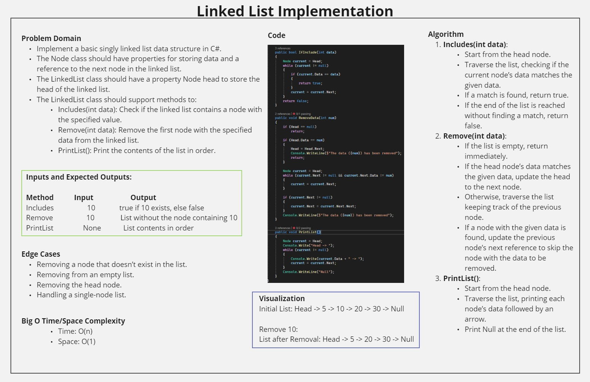
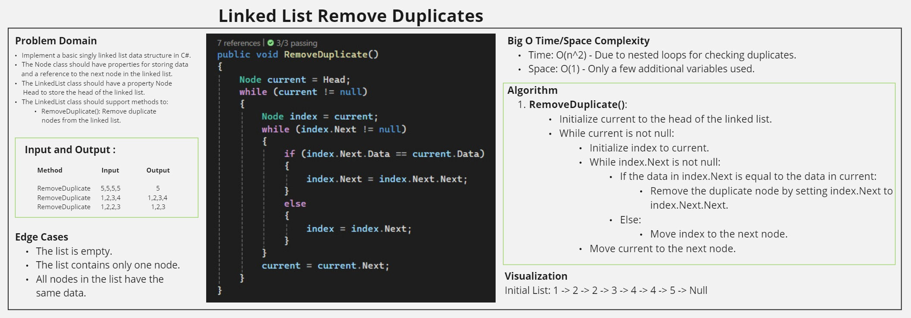

# Linked List Implementation & Remove Duplicates in C#

## Problem Domain
Implement a basic singly linked list data structure in C#.

### Requirements
- The `Node` class should have properties for storing data and a reference to the next node in the linked list.
- The `LinkedList` class should have a property `Node head` to store the head of the linked list.
- The `LinkedList` class should support methods to:
  - `RemoveDuplicate()`: Remove all duplicate nodes from the linked list.

### Ensure your implementation includes:
- A `Node` class with properties for data and a reference to the next node.
- A `LinkedList` class with methods for removing duplicate nodes from the list.
- Handle all exceptions that could be thrown during execution.

## Linked List Implementation Whiteboard

## Linked List Implementation Output

## Remove Duplicates Whiteboard

## Remove Duplicates Output
